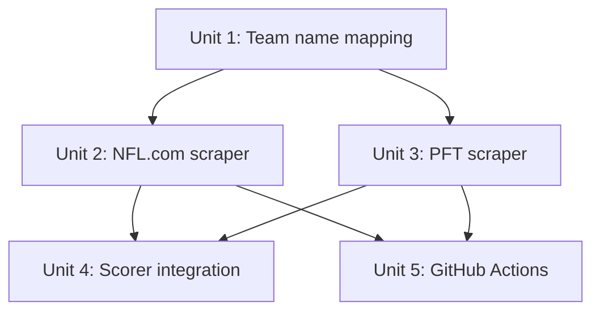

# feat: Add NFL.com and PFT expert pick sources

## Overview

Add two new scrapers (NFL.com and NBC/ProFootballTalk) to bring 7 more experts with full-season consistency into the leaderboard. Update the scorer to load these new sources and flag experts with low participation.

## Problem Frame

The leaderboard has 35 experts but only 11 (ESPN) pick consistently every week. Fantasy Nerds adds 24 but with spotty coverage, making accuracy comparisons unfair. NFL.com (5 editors) and PFT (2 analysts) both pick every game every week with stable panels. (see origin: `docs/brainstorms/2026-04-02-new-pick-sources-requirements.md`)

## Requirements Trace

- R1. Scrape NFL.com picks from HTML tables
- R2, R5. Map display team names ("Eagles", "49ers") to nflverse abbreviations
- R3. Store NFL.com picks as `week-{week}-nfl.json`
- R4. Scrape PFT picks from narrative text lines
- R6. Store PFT picks as `week-{week}-pft.json`
- R7. Match picks to canonical game IDs via nflverse schedule lookup
- R8. Load NFL.com and PFT pick files in the scorer alongside ESPN and Fantasy Nerds
- R9-R11. Add `qualified` boolean to leaderboard entries (50% of scored weeks threshold)
- R12. `urllib.request` only
- R13. `--season` / `--week` CLI arguments

## Scope Boundaries

- No changes to ESPN or Fantasy Nerds scrapers
- No ATS picks from these sources
- No UI work — leaderboard remains JSON
- No NFLPickWatch (fully paywalled — verified)

## Context & Research

### Relevant Code and Patterns

- **Scraper template**: Both `scrape_espn_picks.py` and `scrape_fantasynerds.py` follow identical structure — argparse with `--season`/`--week`, nflreadpy fallback for defaults, `ROOT` constant, scrape function returning standard dict, `update_experts_registry()`, JSON write
- **Pick schema**: 7-field pick objects (`expert`, `expert_name`, `source`, `outlet`, `game_id`, `pick`, `pick_type`)
- **Game ID resolution**: Fantasy Nerds scraper (`scrape_fantasynerds.py:113-124`) uses `frozenset({away, home})` lookup against `nfl.load_schedules()` — reuse this pattern
- **Scorer source loading**: Hardcoded at `score_experts.py:229-236` — two `load_json` calls, iterated in tuple, dedup by `(expert, game_id)`
- **`update_experts_registry()`**: Duplicated in both scrapers. Each loads `data/experts.json`, deduplicates by slug, appends new entries
- **`normalize_team()`**: `normalize.py:34` — abbreviation-to-abbreviation only. No display name support exists

### NFL.com Page Structure (verified)

- URL: `nfl.com/news/nfl-picks-week-{N}-{YEAR}-nfl-season`
- Each game has a MONEYLINE line before its table: `MONEYLINE: Vikings -122 | Bears +102`
- Pick tables have expert first names in header row, cells as `"Team Score-Score"` (e.g., `"Eagles 27-20"`)
- A standings table appears on some weeks (confirmed Week 10) but not all (absent Week 1). Cannot rely on ordinal position — must identify pick tables by MONEYLINE context.

### PFT Page Structure (verified)

- URL: `nbcsports.com/nfl/profootballtalk/rumor-mill/news/pfts-week-{N}-{YEAR}-nfl-picks-florio-vs-simms`
- Each pick line: `Florio's pick: Eagles 30, Cowboys 17.` and `Simms's pick: Eagles 27, Cowboys 20.`
- Both teams appear in every line. Server-rendered, regex-trivial.

### nflreadpy Team Data

`nfl.load_teams()` has 36 rows including historical franchises (STL Rams, SD Chargers, OAK Raiders), causing duplicate `team_nick` values. Not safe for a simple nickname lookup. A static dict of 32 current team nicknames is more reliable.

## Key Technical Decisions

- **Static `TEAM_NICK_TO_ABBREV` dict over dynamic `load_teams()`**: 32 entries is small and stable. `load_teams()` has duplicate nicknames for relocated franchises (Rams: LA/STL/LAR, Chargers: LAC/SD, Raiders: LV/OAK). A static dict avoids the disambiguation problem entirely.
- **MONEYLINE-based game identification**: NFL.com's MONEYLINE line before each table (`MONEYLINE: TeamA ... | TeamB ...`) reliably identifies both teams. This handles unanimous picks (where only one team name appears in the table cells) and avoids the brittle "skip first table" heuristic.
- **Hardcoded source loading in scorer**: Add two more `load_json` calls matching the existing pattern (not dynamic globbing). Source ordering: ESPN → Fantasy Nerds → NFL.com → PFT ensures ESPN pre-game picks win dedup.
- **Dedup at scorer, not scraper**: Scrapers store all experts. The NFL.com and PFT expert panels are entirely different people from ESPN's 11 analysts — no actual overlap exists (verified: Ali Bhanpuri, Brooke Cersosimo, Dan Parr, Gennaro Filice, Tom Blair, Mike Florio, Chris Simms have no slug collisions with ESPN or Fantasy Nerds experts). The scorer's `(expert, game_id)` dedup is a safety net, not an active filter. (see origin)
- **50% of scored weeks for qualification**: `len(expert_weekly) / total_scored_weeks >= 0.5`. "Scored weeks" = weeks with results files. The flag is meaningful only in full-season scoring mode; single-week runs (`--week N`) trivially mark all experts qualified since the denominator is 1. (see origin)
- **PFT pick convention**: The first team in each line is the expert's predicted winner (always has the higher predicted score). Verified across all Week 1 2025 lines.

## Open Questions

### Resolved During Planning

- **How to identify both teams per NFL.com game**: MONEYLINE line before each table provides both team names. Verified in HTML.
- **How to handle the standings table on NFL.com**: Don't skip by position. Identify pick tables by MONEYLINE context in the preceding HTML.
- **Display name resolution strategy**: Static 32-entry dict in `normalize.py`. `nflreadpy.load_teams()` is unreliable due to duplicate nicknames for relocated franchises.
- **Scorer integration approach**: Hardcoded `load_json` calls (matching existing pattern), not dynamic file discovery.
- **No expert slug collisions**: The 7 new experts (5 NFL.com + 2 PFT) are entirely different people from the ESPN and Fantasy Nerds panels. No name collisions exist.
- **PFT pick semantics**: First team in "X's pick: Team1 Score, Team2 Score" is always the predicted winner (higher score). Verified Week 1 2025.

### Deferred to Implementation

- **PFT URL slug stability across all 18 weeks and playoffs**: Verify additional weeks during implementation. The slug may vary for playoff or special weeks.
- **NFL.com MONEYLINE line edge cases**: Confirm the MONEYLINE pattern holds for London games, Monday/Thursday games, and weeks with scheduling changes.
- **Expert name overlap across sources**: Verified — no slug collisions between the 7 new experts and existing ESPN/Fantasy Nerds panels. Moved to Resolved.

## Implementation Units

- [ ] **Unit 1: Add display name mapping to normalize.py**

**Goal:** Enable resolving team display names ("Eagles", "49ers") to nflverse abbreviations.

**Requirements:** R2, R5

**Dependencies:** None

**Files:**
- Modify: `scripts/normalize.py`
- Test: `scripts/test_normalize.py` (create)

**Approach:**
- Add a `TEAM_NICK_TO_ABBREV` dict mapping all 32 current nicknames to canonical abbreviations (e.g., `"Eagles": "PHI"`, `"49ers": "SF"`, `"Commanders": "WAS"`)
- Add a `normalize_team_name(name)` function that looks up in `TEAM_NICK_TO_ABBREV` after stripping whitespace. Return `None` or raise on unrecognized names so scraper failures are loud, not silent.
- Keep `normalize_team()` unchanged — it handles abbreviation variants, the new function handles display names

**Patterns to follow:**
- `ABBREV_ALIASES` dict pattern in `normalize.py:11-23`

**Test scenarios:**
- Happy path: `normalize_team_name("Eagles")` returns `"PHI"`
- Happy path: `normalize_team_name("49ers")` returns `"SF"` (leading digit)
- Happy path: `normalize_team_name("Commanders")` returns `"WAS"` (recently renamed team)
- Edge case: `normalize_team_name(" Eagles ")` handles whitespace
- Error path: `normalize_team_name("Unicorns")` raises or returns None for unknown name

**Verification:**
- All 32 current team nicknames resolve to correct nflverse abbreviations
- Existing `normalize_team()` behavior unchanged

---

- [ ] **Unit 2: NFL.com scraper**

**Goal:** Scrape the 5 NFL.com editors' weekly picks from their picks article.

**Requirements:** R1, R2, R3, R7, R12, R13

**Dependencies:** Unit 1

**Files:**
- Create: `scripts/scrape_nfl_picks.py`
- Test: `scripts/test_scrape_nfl_picks.py` (create)

**Approach:**
- Follow the ESPN/Fantasy Nerds scraper template: argparse, nflreadpy defaults, `ROOT` constant, scrape function, `update_experts_registry()`, JSON write
- Fetch the NFL.com article HTML using `urllib.request` with browser User-Agent
- Parse game sections: find MONEYLINE lines to extract both team nicknames, then parse the `<table>` that follows. All 32 NFL team nicknames are single words (including "49ers" which starts with a digit — `\w+` handles this). Verify the MONEYLINE format holds for all team names during implementation.
- Map expert first names in the header row to full names. The 5 experts are: Ali (Bhanpuri), Brooke (Cersosimo), Dan (Parr), Gennaro (Filice), Tom (Blair). Hard-code the first-to-full name mapping. If any expected name is missing from the header row, fail loudly rather than silently skipping that expert.
- Extract picked team from each cell: regex for the team name prefix of "Team Score-Score" format
- Resolve display names via `normalize_team_name()`, then match teams to canonical game IDs via `load_schedule()` frozenset pattern (from `scrape_fantasynerds.py:113-124`)
- Source identifier: `"nfl_com"`
- Output: `data/picks/{season}/week-{week}-nfl.json`

**Patterns to follow:**
- `scrape_espn_picks.py` for overall structure, argparse, `update_experts_registry()`
- `scrape_fantasynerds.py:113-124` for `load_schedule()` and frozenset game ID matching

**Test scenarios:**
- Happy path: Scraper produces valid JSON with 5 experts x 16 games = 80 picks for a full week
- Happy path: Each pick object has all 7 required fields with correct types
- Happy path: Game IDs match nflverse format (`YYYY_WW_AWAY_HOME`)
- Edge case: Unanimous pick table (all experts pick same team) — MONEYLINE still provides both teams
- Edge case: Standings table present (Week 10+) — correctly skipped via MONEYLINE-based identification
- Edge case: MONEYLINE with "49ers" (leading digit) — regex correctly captures team name
- Error path: Unrecognized team name in MONEYLINE — scraper fails loudly rather than silently producing bad data
- Error path: Expected expert name missing from header row — scraper fails loudly
- Integration: Output JSON loads correctly in `score_experts.py` and expert slugs are unique
- Integration: Verify against multiple weeks (at least Week 1 and Week 10) to confirm structural consistency

**Verification:**
- Run against Week 1 2025: produces `week-1-nfl.json` with 80 picks from 5 experts
- Run against Week 10 2025: handles standings table correctly, still produces correct pick count
- Expert registry (`data/experts.json`) updated with 5 new entries

---

- [ ] **Unit 3: PFT scraper**

**Goal:** Scrape Florio and Simms' weekly picks from the PFT article.

**Requirements:** R4, R5, R6, R7, R12, R13

**Dependencies:** Unit 1

**Files:**
- Create: `scripts/scrape_pft_picks.py`
- Test: `scripts/test_scrape_pft_picks.py` (create)

**Approach:**
- Follow the ESPN/Fantasy Nerds scraper template
- Fetch the PFT article HTML using `urllib.request`
- Parse pick lines with regex: `(Florio|Simms)(?:'s|'s)\s+pick:\s+(\w[\w\s]*?)\s+(\d+),\s+(\w[\w\s]*?)\s+(\d+)` — captures expert name, team1, score1, team2, score2
- The first team in each line is the expert's pick (the team they predict will win)
- Resolve display names via `normalize_team_name()`, match to game IDs via `load_schedule()` frozenset pattern
- Source identifier: `"pft"`
- Output: `data/picks/{season}/week-{week}-pft.json`

**Patterns to follow:**
- `scrape_espn_picks.py` for structure
- `scrape_fantasynerds.py:113-124` for `load_schedule()` frozenset lookup

**Test scenarios:**
- Happy path: Scraper produces valid JSON with 2 experts x 16 games = 32 picks
- Happy path: Each pick correctly identifies the picked team (first team in the line)
- Happy path: Both teams resolved to correct nflverse abbreviations
- Edge case: "Simms's" vs "Simms'" possessive variation — regex handles both
- Edge case: Team names with spaces ("Tampa Bay" in "Buccaneers" context — verify the regex captures multi-word team names or just nicknames)
- Error path: URL returns 404 (article not yet published or different slug format) — fail with clear message
- Integration: Output JSON loads correctly in `score_experts.py`

**Verification:**
- Run against Week 1 2025: produces `week-1-pft.json` with 32 picks from 2 experts
- Run against at least one mid-season week to verify URL slug consistency
- Expert registry updated with 2 new entries (Mike Florio, Chris Simms)

---

- [ ] **Unit 4: Scorer integration and qualification flag**

**Goal:** Load NFL.com and PFT pick files in the scorer. Add `qualified` boolean to leaderboard entries.

**Requirements:** R8, R9, R10, R11

**Dependencies:** Units 2 and 3 (need pick files to verify)

**Files:**
- Modify: `scripts/score_experts.py`
- Test: `scripts/test_score_experts.py` (create)

**Approach:**
- Add two `load_json` calls after the existing Fantasy Nerds load: one for `week-{w}-nfl.json`, one for `week-{w}-pft.json`
- Extend the source iteration tuple to include the two new sources. Source ordering (ESPN first) ensures ESPN picks win dedup.
- Note: `find_scored_weeks()` already correctly discovers weeks from any pick file suffix via its `week-*.json` glob — no modification needed.
- In `build_leaderboard()`, add `qualified` field to each expert entry: `qualified = len(expert_weekly) / total_scored_weeks >= 0.5`. `total_scored_weeks` = number of distinct weeks returned by `find_scored_weeks()` (weeks that have both pick files AND results files). `expert_weekly` = weeks where this expert has at least one scored pick. An expert with 0 picks in a week won't have a weekly entry, so they naturally fail the threshold. The flag is meaningful in full-season mode; single-week runs trivially mark all participating experts qualified.
- `source` field in pick objects is the scraper identifier (e.g., `"nfl_com"`, `"pft"`). `outlet` is the media organization (e.g., `"NFL.com"`, `"ProFootballTalk"`). Both fields already exist in the 7-field pick schema — no schema change needed.

**Patterns to follow:**
- Existing `load_json` + dedup pattern at `score_experts.py:229-243`
- ATS scoring extension pattern in `build_leaderboard()` for adding new fields

**Test scenarios:**
- Happy path: Scorer loads all 4 sources and produces leaderboard with ~42 experts
- Happy path: ESPN expert appearing in both ESPN and NFL.com pick files — only ESPN pick counted (dedup)
- Happy path: Expert with 18/18 weeks → `qualified: true`
- Happy path: Expert with 3/18 weeks → `qualified: false`
- Edge case: Expert with exactly 9/18 weeks (50% boundary) → `qualified: true`
- Edge case: Missing pick file (e.g., no `week-5-nfl.json`) → `load_json` returns `None`, skipped gracefully (existing pattern)
- Edge case: Single-week scoring (`--week 5`) → 1 scored week, all experts qualified
- Integration: Leaderboard JSON includes `qualified` field for every expert

**Verification:**
- Leaderboard JSON has ~42 experts (up from ~35)
- All NFL.com and PFT experts appear with `qualified: true` (full coverage)
- Fantasy Nerds experts with spotty coverage flagged `qualified: false` where applicable
- Existing ESPN expert records unchanged

---

- [ ] **Unit 5: GitHub Actions workflow**

**Goal:** Automate the new scrapers in CI.

**Requirements:** R13

**Dependencies:** Units 2 and 3

**Files:**
- Modify: `.github/workflows/scrape-picks.yml`

**Approach:**
- Add two new steps after the existing ESPN scrape step (line 46-47 of `scrape-picks.yml`)
- Each step runs the new scraper with `$ARGS` (same `--season`/`--week` pass-through pattern)
- Add `data/picks/` paths to the git add/commit block if not already covered by the existing glob
- Consider: NFL.com and PFT articles may be published at different times than ESPN. The workflow runs Wednesdays 12:00 UTC. Verify this timing works for both sources during implementation.

**Patterns to follow:**
- Existing ESPN step in `scrape-picks.yml:46-47` for the exact run pattern
- Off-season guard and commit pattern already in the workflow

**Test expectation:** none — workflow changes are verified by manual `workflow_dispatch` run

**Verification:**
- `workflow_dispatch` with `--season 2025 --week 1` produces pick files for all 4 sources and commits them

## System-Wide Impact

- **Interaction graph:** The new scrapers are independent of each other and existing scrapers. They share `normalize.py` utilities and the `data/experts.json` registry. The scorer reads their output files.
- **Error propagation:** If a new scraper fails (HTTP error, changed HTML structure), it produces no pick file. The scorer's `load_json` returns `None` for missing files, so scoring proceeds with available sources. No cascading failure.
- **State lifecycle risks:** `update_experts_registry()` appends to `data/experts.json`. If both new scrapers run in the same CI job, they write sequentially (not concurrently), so no race condition.
- **Unchanged invariants:** ESPN scraper, Fantasy Nerds scraper, `fetch_results.py`, existing pick file formats, and leaderboard sort order are all unchanged. The only leaderboard schema change is the new `qualified` field. Downstream consumers of `leaderboard.json` should tolerate the new field (additive change).
- **Known duplication:** `update_experts_registry()` is already duplicated in the two existing scrapers. Adding two more scrapers extends this to 4 copies. Consider extracting to `normalize.py` as a follow-up, but not in scope for this plan.
- **Pre-existing CI gap:** The Fantasy Nerds scraper is not in the GitHub Actions workflow (run manually). This plan adds only the new scrapers to CI, not Fantasy Nerds.

## Risks & Dependencies

| Risk | Mitigation |
|------|------------|
| NFL.com changes article structure or URL pattern | Regex-based parsing is inherently brittle. The scraper will fail loudly on unexpected HTML. Monitor CI runs. |
| PFT changes the "Florio vs. Simms" format or URL slug | Same mitigation — fail loudly, fix the regex. URL stability is an open question deferred to implementation. |
| NFL.com blocks `urllib.request` | Existing ESPN scraper uses the same approach without issues. Use browser User-Agent header. |
| Team name mapping becomes stale (expansion, relocation) | The NFL hasn't expanded since 2002. Relocation requires updating `TEAM_NICK_TO_ABBREV` — a one-line dict change. |

## Sources & References

- **Origin document:** [docs/brainstorms/2026-04-02-new-pick-sources-requirements.md](docs/brainstorms/2026-04-02-new-pick-sources-requirements.md)
- Existing scraper patterns: `scripts/scrape_espn_picks.py`, `scripts/scrape_fantasynerds.py`
- Scorer integration point: `scripts/score_experts.py:229-243`
- Team normalization: `scripts/normalize.py`
- GitHub Actions: `.github/workflows/scrape-picks.yml`
